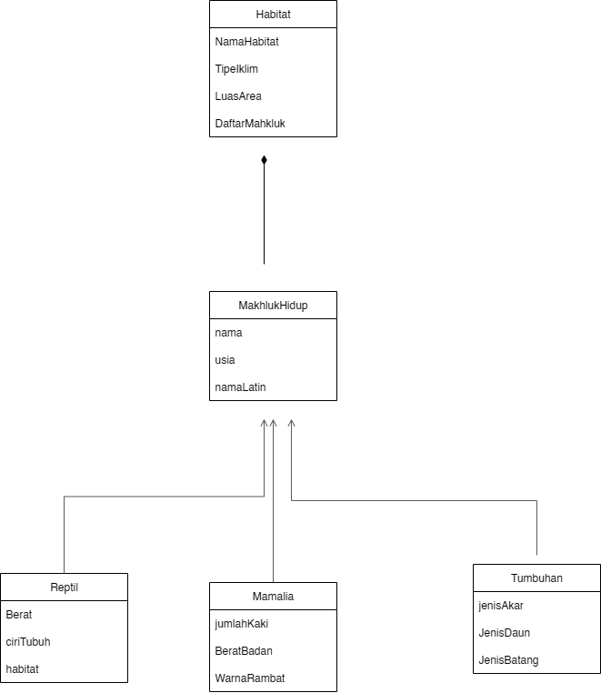

# Tugas Praktikum 3 - Simulasi Ekosistem OOP

Sebuah program simulasi ekosistem sederhana yang menerapkan konsep **Inheritance, Polymorphism, dan Composition** dalam bahasa Python dan C++. Program ini memungkinkan pengguna untuk mengelola beberapa habitat dan makhluk hidup di dalamnya.

---

## Daftar Isi
1. [Desain Program (UML)](#desain-program-uml)
2. [Struktur Kelas](#struktur-kelas)
3. [Alur Program](#alur-program)
4. [Cara Menjalankan](#cara-menjalankan)
5. [Dokumentasi](#dokumentasi)
6. [Janji](#janji)

---

## Desain Program (UML)
Diagram UML berikut merepresentasikan arsitektur dan hubungan antar kelas dalam program.

<strong>Klik untuk melihat penjelasan detail desain</strong>

### Relasi Pewarisan (Inheritance)
* **Konsep:** "Dari Umum ke Khusus". Kelas `MakhlukHidup` bertindak sebagai **kelas induk** yang menyimpan atribut umum. Kelas `Mamalia`, `Reptil`, dan `Tumbuhan` adalah **kelas turunan** yang mewarisi sifat dari `MakhlukHidup` dan menambahkan atribut uniknya sendiri.
* **Alasan Desain:** Desain ini mencerminkan hubungan **"adalah sebuah" (is-a)**. Contoh: `Mamalia` adalah sebuah `MakhlukHidup`. Ini menghindari duplikasi kode dan membuat struktur program logis sesuai klasifikasi dunia nyata.

### Relasi Komposisi (Composition)
* **Konsep:** "Wadah dan Isinya". Kelas `Habitat` tidak mewarisi dari kelas manapun, melainkan **memiliki** atau **terdiri dari** kumpulan objek `MakhlukHidup`.
* **Alasan Desain:** Desain ini mencerminkan hubungan **"memiliki sebuah" (has-a)**. Contoh: `Habitat` memiliki `MakhlukHidup`. Ini secara logis memisahkan antara konsep **lingkungan** dengan **penghuninya**.

---

## Struktur Kelas

Berikut adalah rincian atribut dan method untuk setiap kelas.

### `MakhlukHidup` (Base Class)
| Atribut | Tipe | Deskripsi |
|---|---|---|
| `nama` | `string` | Nama umum dari makhluk hidup. |
| `usia` | `int` | Usia atau rentang hidup makhluk. |
| `namaLatin` | `string` | Nama ilmiah dari makhluk hidup. |

| Method | Deskripsi |
|---|---|
| `displayInfo()` | Method `virtual` yang menampilkan informasi dasar. |

### `Mamalia`, `Reptil`, & `Tumbuhan` (Derived Classes)
Kelas-kelas ini mewarisi semua atribut `MakhlukHidup` dan menambahkan atribut spesifik:

| Kelas | Atribut Spesifik | Deskripsi |
|---|---|---|
| **Mamalia** | `jumlahKaki`, `BeratBadan`, `WarnaRambut` | Ciri khas fisik untuk membedakan mamalia. |
| **Reptil** | `Berat`, `ciriTubuh`, `habitat` | Ciri khas untuk reptil, seperti "bersisik". |
| **Tumbuhan**| `jenisAkar`, `JenisDaun`, `JenisBatang` | Komponen anatomi dasar dari tumbuhan. |

Setiap kelas turunan juga meng-`override` method `displayInfo()` untuk menampilkan detail spesifiknya.

### `Habitat` (Composition Class)
| Atribut | Tipe | Deskripsi |
|---|---|---|
| `NamaHabitat` | `string` | Nama dari lingkungan (contoh: "Sabana"). |
| `TipeIklim` | `string` | Kondisi iklim dari habitat (contoh: "Kering"). |
| `LuasArea` | `int` | Ukuran luas dari habitat (dalam km²). |
| `DaftarMakhluk` | `vector<MakhlukHidup*>` | Kumpulan objek yang menghuni habitat. |

| Method | Deskripsi |
|---|---|
| `tambahMakhluk()` | Menambahkan objek `MakhlukHidup` baru ke dalam habitat. |
| `tampilkanSemuaMakhluk()` | Menampilkan informasi semua makhluk yang ada di habitat. |

---

## Alur Program
1.  **Inisialisasi:** Program dimulai, membuat beberapa objek `Habitat`, dan memuat data awal (*hardcode*) ke habitat yang sesuai.
2.  **Menu Utama:** Sebuah `loop` menampilkan menu utama kepada pengguna:
    - `1. Tambah Data Makhluk Baru`
    - `2. Tampilkan Semua Data Ekosistem`
    - `3. Keluar`
3.  **Tambah Data:** Pengguna memilih habitat, jenis makhluk, lalu memasukkan data yang diminta. Objek baru akan dibuat dan ditambahkan ke habitat tersebut.
4.  **Tampilkan Data:** Program akan menampilkan informasi dari setiap habitat, diikuti oleh detail semua makhluk yang tinggal di dalamnya.
5.  **Keluar:** Program menampilkan pesan penutup dan berhenti.

---

